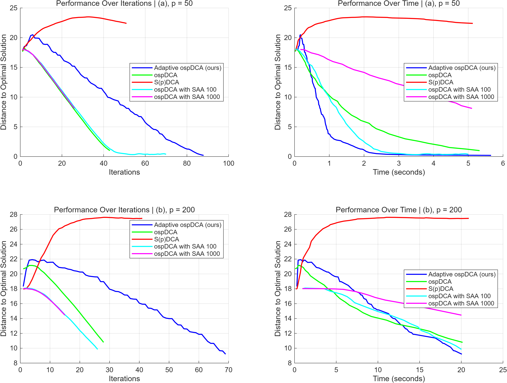
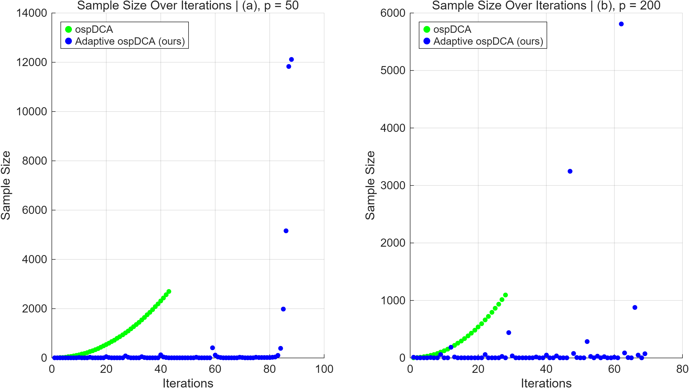
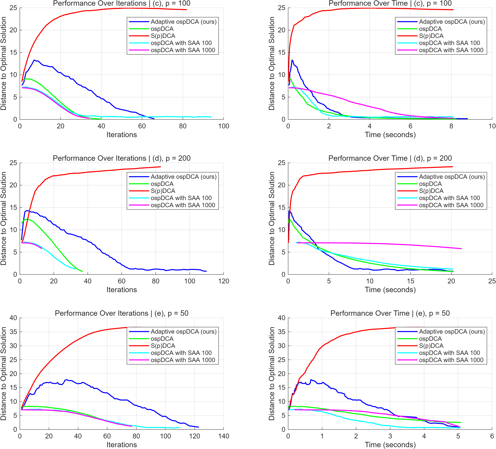
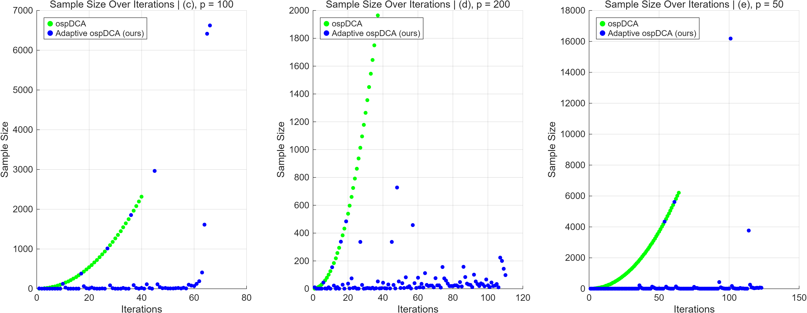

# An Online Adaptive Sampling Algorithm for Stochastic Difference-of-convex Optimization with Time-varying Distributions

This repository contains MATLAB code for the numerical experiments in the paper **An Online Adaptive Sampling Algorithm for Stochastic Difference-of-convex Optimization with Time-varying Distributions**.

The repository is organized around two driver scripts and one shared implementation file:

- `run_main_paper_experiments.m`
- `run_appendix_experiments.m`
- `online_sparse_robust_regression_suite.m`

The main-paper experiments and the appendix experiments are separated into two scripts, while the shared data generation, optimization routines, and plotting functions are collected in one self-contained MATLAB file.

---

## Project Overview

We consider online sparse robust regression under time-varying data distributions. At iteration $t$, the feature vector is sampled from $[-1,1]^p$, and the response is generated by

```math
y_t = x_t^\top (\beta^\star + \delta_t) + \varepsilon_t,
\qquad
\varepsilon_t \sim N(0,1).
```

The optimization problem is

```math
\min_{\beta \in \mathbb{R}^p}
\mathbb{E}[|y - x^\top \beta|]
+ \lambda \sum_{j=1}^p \min(1,\alpha |\beta_j|).
```

The regularizer is a capped-$\ell_1$ penalty, which promotes sparsity and admits a DC decomposition.

The code compares five methods:

1. **Adaptive ospDCA**
2. **ospDCA with predetermined sample size $N_t = \lceil t^{2.1} \rceil$**
3. **S(p)DCA with one new sample per iteration and cumulative sample averages**
4. **ospDCA with fixed sample size 100**
5. **ospDCA with fixed sample size 1000**

The performance is evaluated by the distance between the current iterate and the target sparse solution, by wall-clock time, and by the sample size used at each iteration.

---

## Experiment Setup

### Common parameters

The experiments use the following common parameters:

- $\alpha = 1$
- $\lambda = 0.01$
- proximal coefficient $\mu = 1$
- adaptive-sampling constants: $C_g = 1$ and $\alpha_g = 0.45$
- initial sample size = 10
- stopping tolerance on successive iterates = `1e-10`

The implementation uses MATLAB `fminunc` to solve the convex subproblem arising at each DCA iteration.

### Main paper experiments

These reproduce Figures 1 and 2 in the paper.

- **Experiment (a):** $p = 50$, $\beta^\star = [10,-15,0,\ldots,0]$
- **Experiment (b):** $p = 200$, $\beta^\star = [10,-15,0,\ldots,0]$

For both main-paper experiments, the distribution shift is

```math
\delta_t = (-1)^t \cdot 100\, t^{-2} \cdot \mathbf{1}_p.
```

### Appendix experiments

These reproduce Figures 3 and 4 in the appendix.

- **Experiment (c):** $p = 100$, $\beta^\star = [5,-5,0,\ldots,0]$
- **Experiment (d):** $p = 200$, $\beta^\star = [5,-5,0,\ldots,0]$
- **Experiment (e):** $p = 50$, $\beta^\star = [5,-5,0,\ldots,0]$

For experiments (c) and (d), the distribution shift is

```math
\delta_t = (-1)^t \cdot 100\, t^{-2} \cdot \mathbf{1}_p.
```

For experiment (e), a larger time-varying shift is used:

```math
\delta_t = (-1)^t \cdot 5000\, t^{-2} \cdot \mathbf{1}_p.
```

### Runtime limits

The experiments use the following runtime limits:

- **(a)** 5 seconds
- **(b)** 20 seconds
- **(c)** 8 seconds
- **(d)** 20 seconds
- **(e)** 5 seconds

A fixed random seed is used for reproducibility.

---

## Repository Structure

```text
Online-adaptive-sampling-algorithm-for-stochastic-DC-optimization-with-time-varying-distributions/
├── run_main_paper_experiments.m
├── run_appendix_experiments.m
├── online_sparse_robust_regression_suite.m
├── results/
│   ├── main_figure1_behavior.png
│   ├── main_figure2_sample_size.png
│   ├── appendix_figure3_behavior.png
│   ├── appendix_figure4_sample_size.png
│   ├── main_summary.mat
│   └── appendix_summary.mat
├── An Online Adaptive Sampling Algorithm for Stochastic Difference-of-convex Optimization with Time-varying Distributions.pdf
└── README.md
```

---

## Requirements

- MATLAB
- Optimization Toolbox (`fminunc`)

No external dataset is required.

---

## How to Run

Open MATLAB in the repository folder.

### Main paper figures

Run

```matlab
run_main_paper_experiments
```

This generates:

- `results/main_figure1_behavior.png`
- `results/main_figure2_sample_size.png`
- `results/main_summary.mat`

### Appendix figures

Run

```matlab
run_appendix_experiments
```

This generates:

- `results/appendix_figure3_behavior.png`
- `results/appendix_figure4_sample_size.png`
- `results/appendix_summary.mat`

---

## Generated Files

The generated figures have the following meanings:

- `main_figure1_behavior.png`: performance curves for experiments (a) and (b), including distance to $\beta^\star$ versus iterations and versus wall-clock time
- `main_figure2_sample_size.png`: sample-size trajectories for adaptive ospDCA and predetermined-schedule ospDCA in experiments (a) and (b)
- `appendix_figure3_behavior.png`: performance curves for experiments (c), (d), and (e)
- `appendix_figure4_sample_size.png`: sample-size trajectories for experiments (c), (d), and (e)

The `.mat` summary files store the underlying numerical outputs, including iterates, distances, elapsed times, and sample sizes.

---

## Sample Results

The image paths below assume that the generated PNG files under `results/` are committed to the repository.

### Main paper figures

#### Figure 1: algorithm behavior



This figure shows the distance to $\beta^\star$ over iterations and over wall-clock time for experiments (a) and (b).

#### Figure 2: sample-size behavior



This figure compares the adaptive sample-size rule with the predetermined schedule in the two main-paper settings.

### Appendix figures

#### Figure 3: algorithm behavior for additional experiments



This figure reports the behavior of the five methods for experiments (c), (d), and (e).

#### Figure 4: sample-size behavior for additional experiments



This figure shows the sample-size trajectories for experiments (c), (d), and (e), comparing adaptive ospDCA with the predetermined schedule.

---

## Citation

If you use this code, please cite:

```bibtex
@InProceedings{pmlr-v267-ye25c,
  title = {An Online Adaptive Sampling Algorithm for Stochastic Difference-of-convex Optimization with Time-varying Distributions},
  author = {Ye, Yuhan and Cui, Ying and Wang, Jingyi},
  booktitle = {Proceedings of the 42nd International Conference on Machine Learning},
  pages = {71959--71978},
  year = {2025},
  volume = {267},
  series = {Proceedings of Machine Learning Research},
  publisher = {PMLR}
}
```

## Author

Yuhan Ye
